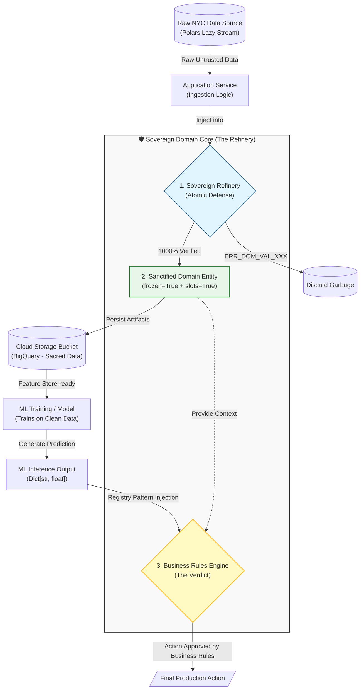

# 🚕 STIE: Sovereign Taxi Inference Engine

### *The Sovereign Hexagonal Blueprint for Industrial ML*

> **"Architecture is the art of planning for the unknown. We don't just build code; we build sovereign digital assets designed to outlast the tools."**

______________________________________________________________________

### 👤 Principal Architect & Strategic Inquiry

**Ali Ahmed Nour** *Principal Architect for Sovereign Hexagonal & DDD Systems*

[](https://www.linkedin.com/in/ali-ahmed-nour/)
[](https://wa.me/201007871314)
[](tel:+201288061914)
[](tel:+201007871314)

______________________________________________________________________

## 🗺️ System Blueprint (The Sovereign Data Loop)



______________________________________________________________________

## Part II: The Sovereign Thesis & Strategic Values

### ⚖️ The Rationale: First Principles Engineering

STIE is engineered for **Mission-Critical Environments** where logic must govern prediction. We apply the **Sovereign Protocol** to ensure:

- **The Supreme Verdict:** The ML model acts as a "Consultant." The Sovereign Core acts as the "Judge." If a prediction violates physical reality (e.g., Velocity > 125 mph), the Core enforces the safe limit.
- **Physical Invariants:** We don't just validate data; we enforce the laws of physics and urban mobility through **Atomic Defense**.
- **Architectural Longevity:** By isolating logic from "Interchangeable Tools," the system remains a permanent asset that outlasts the tools.

### 🎯 The Sovereign Thesis

STIE is a Future-Proof engineered **Unified Inference Hub**. In this architecture, the **Business Logic is the Sovereign Power**. The core is a **Sovereign Sanctuary** (Domain Core) with zero external dependencies. All external tools (Cloud providers, ML Engines) are merely **"Interchangeable Gears" (تروس)** that serve the logic; the logic never serves them.

### 💎 Strategic Core Values

- **The Refinery Protocol:** Zero-tolerance for data noise. We treat data as unrefined ore; only "Sanctified" records reach the BigQuery sink.
- **Economic Optimization:** Powered by **Polars (Lazy API)**, maximizing throughput while minimizing cloud costs—essential for high-scale urban deployments.
- **Institutional Transparency:** Adherence to the **SDDL (Self-Documenting Domain Language)** ensures that the engineering "Why" is never lost, making the system a transparent, audit-ready asset.
- **Strict Provenance:** Every entity carries its `source_id`, ensuring 100% traceability from raw ingestion to final inference verdict.

______________________________________________________________________

## Part III: Engineering & Quality DNA

### 🛡️ Sovereign Hexagonal Implementation

- **Domain Core (The Sanctuary):** Zero external library imports (Standard Python 3.12+).
- **Application Layer (The Orchestrator):** Defines **Strict Ports** (Interfaces) for data ingestion and inference.
- **Infrastructure Layer (The Laborers):** Swappable adapters for Polars, ML engines, and Cloud APIs.

### ⚡ Performance & Integrity Guardrails

- **Memory Efficiency (SOTA):** Mandated `slots=True` and `frozen=True` for extreme RAM optimization and sub-second processing.
- **The Lazy Protocol:** Integration of **Polars Lazy API** for optimized query pushdown and zero-copy ingestion.
- **Sovereign Registry Pattern:** Flexible `Dict[str, float]` for multi-model scalability (Duration, Tip, Cancellation) within the core entity.

### 🧪 Quality & MLOps Governance

- **Enterprise-Grade Code Quality:** Managed via **SonarQube** for continuous monitoring of Technical Debt.
- **Sovereign Error Taxonomy:** Every failure returns a deterministic code (e.g., `ERR_DOM_VAL_001`).
- **Shield Protocol:** Mandatory **Pre-commit Hooks** enforcing strict linting before any persistence.
- **Security & Compliance:** **Mend (WhiteSource)** integration for continuous vulnerability scanning.
- **Static Guardrails:** Strict **Pyright** static analysis to ensure 100% type-safety.
- **Test & Logic Integrity:** Enforced via **pytest** and **pytest-cov** for automated coverage reporting.
- **Quality Suite:** Advanced stress testing powered by **Hypothesis** (PBT) and **Factory-Boy**.
- **Deterministic Environments:** Powered by **uv project** (Mandatory).
- **Model Provenance:** **MLflow** integration for full experiment lineage.

______________________________________________________________________

## Part IV: Documentation & Execution Roadmap

## 📂 Documentation Hub

Refer to our **Sovereign Documentation Hub** (10-File Standard) for deep architectural insights:

### 🏛️ 01_Architecture_Strategy

- **[Hexagonal Layers](docs/01_Architecture_Strategy/hexagonal_layers.md):** Isolation mandates.
- **[Platform Vision](docs/01_Architecture_Strategy/platform_vision.md):** The 2026 Strategic Blueprint.

### 🛡️ 02_Domain_Core

- **[Unified Entity](docs/02_Domain_Core/unified_entity.md):** Aggregate roots & State design.
- **[Validation Invariants](docs/02_Domain_Core/validation_invariants.md):** Atomic Defense rules.

### ⚙️ 03_Infrastructure_Adapters

- **[Data Ingestion](docs/03_Infrastructure_Adapters/data_ingestion.md):** Polars Lazy implementation.
- **[Experiment Tracking](docs/03_Infrastructure_Adapters/experiment_tracking.md):** MLflow provenance.
- **[Prediction Protocol](docs/03_Infrastructure_Adapters/prediction_protocol.md):** Model registry pattern.

### 🧪 04_Quality_Assurance

- **[Error Codes](docs/04_Quality_Assurance/error_codes.md):** Sovereign taxonomy.
- **[Testing Strategy](docs/04_Quality_Assurance/testing_strategy.md):** Property-Based Testing (Hypothesis).

### 📜 Global Manifesto

- **[Global Manifesto](docs/global_manifesto.md):** The Supreme Engineering Rationale.

### 🚧 Execution Roadmap

| Phase | Milestone | Strategic Objective | Target Context | Status |
| :--- | :--- | :--- | :--- | :--- |
| **1** | **Foundational DNA** | Environment Hardening & Security. | `uv`, `Ruff`, `pre-commit` | ✅ Done |
| **2** | **Structural Blueprint** | Defining Hexagonal Ports (Interfaces). | `core/application/ports/` | ✅ Done |
| **3** | **Sovereign Brain** | **Crafting Domain Entities & Atomic Defense.** | `core/domain/` | ✅ Done |
| **4** | **Orchestration** | Implementing Core Use-Cases & Workflows. | `core/application/use_cases/` | 🚀 **Ongoing** |
| **5** | **Infrastructure** | Developing Laborers for Polars & ML. | `infrastructure/adapters/` | ⏳ Pending |
| **6** | **Industrial Ops** | Integration & Enterprise-Grade QA. | `main.py`, `SonarQube` | ⏳ Pending |

______________________________________________________________________

### 🚀 Quick Start

```bash
# Sync sovereign environment
uv sync
source .venv/bin/activate

# Execute Quality Suite
pytest
```

______________________________________________________________________

> *"Architected for the Future of NYC Mobility. Designed to Outlast the Tools."*
